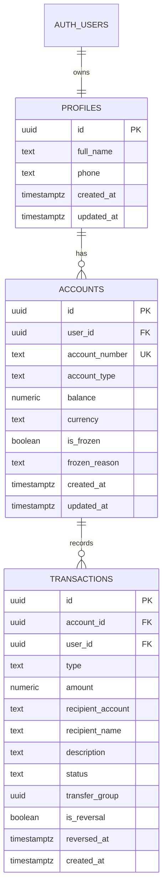
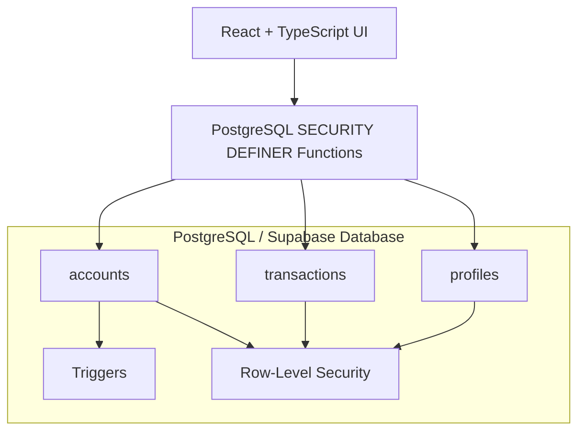
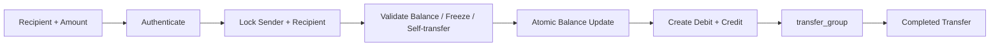
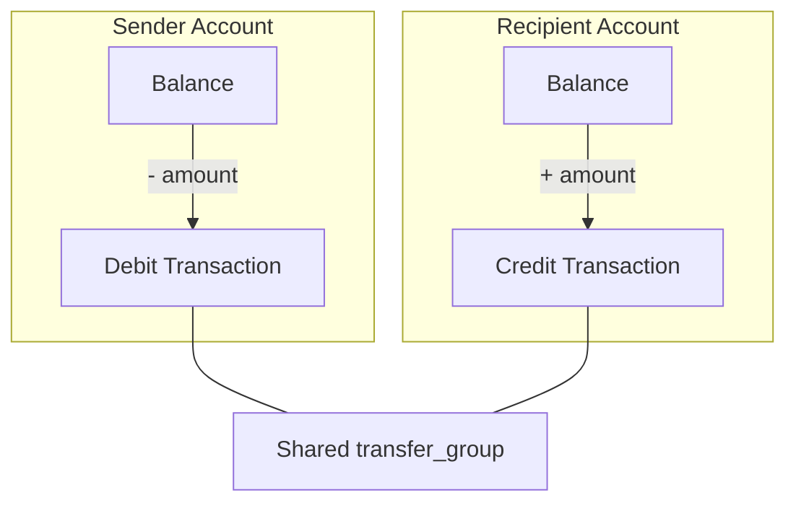
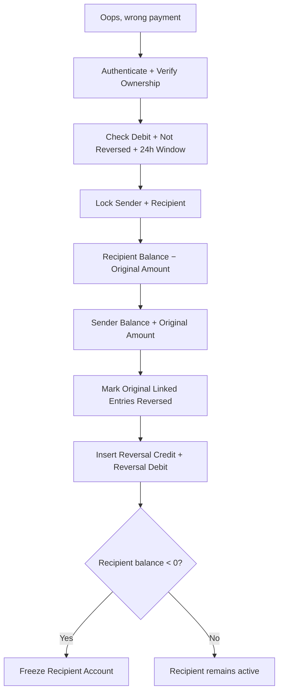
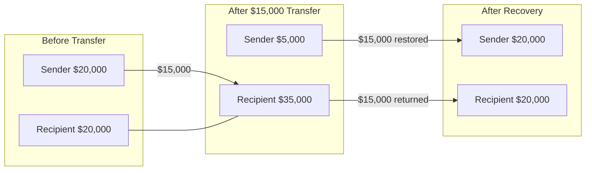
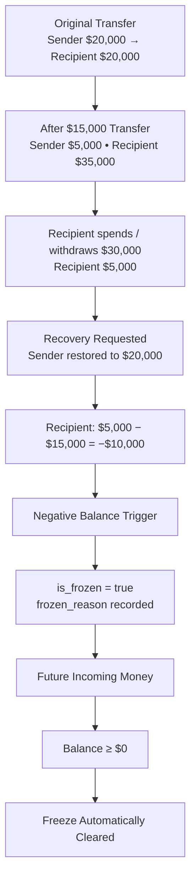
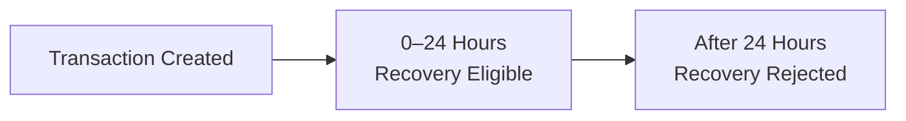

# SAI Bank – Secure Digital Banking with 24‑Hour Payment Protection

SAI Bank is a demo digital‑banking web app built with React, Vite, TypeScript, Tailwind CSS, and shadcn‑ui. It showcases secure account management, real‑time transfers, and a **24‑hour database-controlled payment recovery window** for mistaken transfers.

---

## Core Features

- **Modern onboarding & auth**  
  Email‑based sign up / sign in with persistent sessions.

- **Responsive dashboard**  
  - Shows current account balance and basic account info
  - Lists the most recent transactions
  - Navigation to **Send Money** and **Transaction History**

- **Send Money flow** (`/send`)
  - Select a recipient from existing customers via **"Select Recipient (Optional)"** dropdown.
  - Or manually enter **recipient account number** and **recipient name**.
  - Enter **amount** and optional **description**.
  - Client‑side validation with Zod.
  - Transfer is processed through the database `transfer_money()` function, which debits the sender, credits the recipient, and creates linked ledger entries.

- **Transaction History** (`/transactions`)
  - Full list of the user’s transactions.
  - Clear visual indicators for incoming credits and outgoing debits.
  - Shows description, recipient details, status, amount, and timestamp.
  - Eligible debits expose **“Oops, wrong payment”**.

- **24‑Hour Payment Recovery**
  - The database recovery procedure allows eligible outgoing payments to be reversed within **24 hours**.
  - It authenticates the caller, verifies ownership, checks the debit and recovery state, locks both accounts, pulls the amount back from the recipient, restores the sender, and records compensating ledger entries.
  - If the recipient no longer has enough funds, the recipient can enter a negative balance and the database trigger automatically freezes that account.

---

## 📸 Live Project Evidence

The screenshots below document the actual working UI shown by the live SAI Bank application.

### Transaction History — Reversed Payment

> **Live screen:** [Open Transaction History](https://saibank.lovable.app/transactions)

The screen demonstrates the original payment marked **reversed** and the separate **“Wrong payment reversed - amount restored”** credit entry.

### Reversal Window — Eligible Payment

> **Live screen:** [Open Reversal Window](https://saibank.lovable.app/transactions)

The eligible debit displays **“Oops, wrong payment”** and the remaining recovery time.

### Dashboard — Transaction Ledger

> **Live screen:** [Open Dashboard](https://saibank.lovable.app/dashboard)

The dashboard displays recent debit/credit activity, including reversal-related ledger entries.

---

## 🗄️ Database Design Architecture

The implementation is database-first: account balances live in `accounts`, transaction history lives in `transactions`, and the main transfer/recovery rules execute inside PostgreSQL functions and triggers.

### Entity Relationship Diagram



**Database relationship:** `transfer_group` logically connects the sender debit and recipient credit belonging to one transfer. It is not a separate physical `transfers` table.

### Database Layer Architecture



---

## 🔄 Transfer Processing Architecture



### Database Transaction Model



This is backed by `transfer_money()`, which uses `FOR UPDATE` row locks and performs the sender/recipient balance changes plus ledger inserts as one database operation.

---

## ↩️ Wrong-Payment Recovery Architecture



---

## 🧪 Case Studies

### Case Study 1 — Recipient Still Has Enough Money

**Scenario:** Sender transfers **$15,000** by mistake and requests recovery while the recipient still has enough money.



**Database result**

- Original sender debit → `status = reversed`
- Original recipient credit → `status = reversed`
- Sender gets a compensating `credit`
- Recipient gets a compensating `debit`
- `transfer_group` keeps all related entries traceable

---

### Case Study 2 — Recipient Already Withdrew / Spent the Money

**Scenario:** The recipient has already spent or withdrawn enough money that the original amount is no longer available.



### Why This Database Case Matters

The database does not pretend that the recipient still owns money that has already been spent. Instead:

1. Sender is restored immediately.
2. Recipient balance records the recovery deficit.
3. Negative balance automatically sets `is_frozen = true`.
4. Sending is restricted while the deficit exists.
5. Future incoming funds can clear the deficit.
6. The trigger removes the freeze once the balance is non-negative.

---

### Case Study 3 — Recovery Window Expired



The database procedure rejects recovery when:

``now() - created_at > INTERVAL '24 hours'``

---

## 🛡️ Database Security & Integrity Controls

| Control | Implementation |
|---|---|
| Authentication | `auth.uid()` identifies the caller |
| Row-Level Security | RLS protects authenticated data access |
| Ownership validation | Recovery checks transaction/account ownership |
| Row locking | `FOR UPDATE` locks sender and recipient rows |
| Balance validation | Rejects non-positive amounts and insufficient sender funds |
| Self-transfer protection | Prevents sending to the same account |
| Recovery window | Database-side 24-hour check |
| Duplicate recovery protection | `reversed_at` + `is_reversal` |
| Transfer linkage | `transfer_group` |
| Negative balance handling | Trigger freezes negative recipient accounts |
| Audit trail | Reversed source records + compensating ledger entries |

---

## Architecture Overview

**Frontend**
- Vite + React + TypeScript
- Tailwind CSS
- shadcn-ui
- `src/pages/SendMoney.tsx`
- `src/pages/Transactions.tsx`
- `src/pages/Dashboard.tsx`

**Backend**
- Supabase / PostgreSQL
- `accounts`
- `profiles`
- `transactions`
- PostgreSQL functions
- PostgreSQL triggers
- Row-Level Security

**Database Functions**
- `transfer_money()` — atomic sender/recipient transfer and ledger creation.
- `reverse_transaction()` — 24-hour recovery, linked transaction reversal, sender restoration, and recipient negative-balance handling.

---

## Key Files to Explore

- **Send money UX:** `src/pages/SendMoney.tsx`
- **Transaction history:** `src/pages/Transactions.tsx`
- **Database schema:** `supabase/migrations/20251124144103_42d0ffa9-ef97-4422-863c-ed276f9c8fcb.sql`
- **Transfer & recovery SQL:** `drizzle/migrations/0000_transfer_and_24h_reversal_with_freeze.sql`
- **Reversed status migration:** `drizzle/migrations/0001_allow_reversed_status.sql`
- **Legacy edge function:** `supabase/functions/wrong-payment-reversal/index.ts`

---

## Running the Project Locally

> These steps apply if you’ve cloned the repository to work in your own environment. If you’re using Lovable directly, you can simply open the project in the browser and use the built‑in editor.

### Prerequisites

- Node.js and npm installed (Node 18+ recommended)
- nvm is also supported: https://github.com/nvm-sh/nvm#installing-and-updating

### Setup

```bash
git clone https://github.com/pallasivasai/saibank.git
cd saibank
npm install
npm run dev
```

### Environment Variables

When running inside Lovable Cloud, environment variables are already configured.

For external local development, configure:

- `VITE_SUPABASE_URL`
- `VITE_SUPABASE_PUBLISHABLE_KEY`

---

## Deploying

If you’re using Lovable:

1. Open the project in Lovable.
2. Click **Share → Publish**.
3. Frontend changes go live after you click **Update** in the publish dialog.
4. Database / backend changes are deployed through the project backend.

---

## Project Links

- **GitHub:** https://github.com/pallasivasai/saibank
- **Live application:** https://saibank.lovable.app/
- **Transaction history:** https://saibank.lovable.app/transactions
